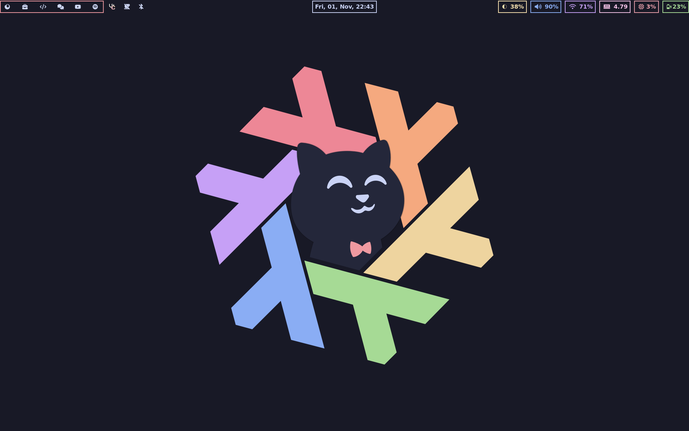
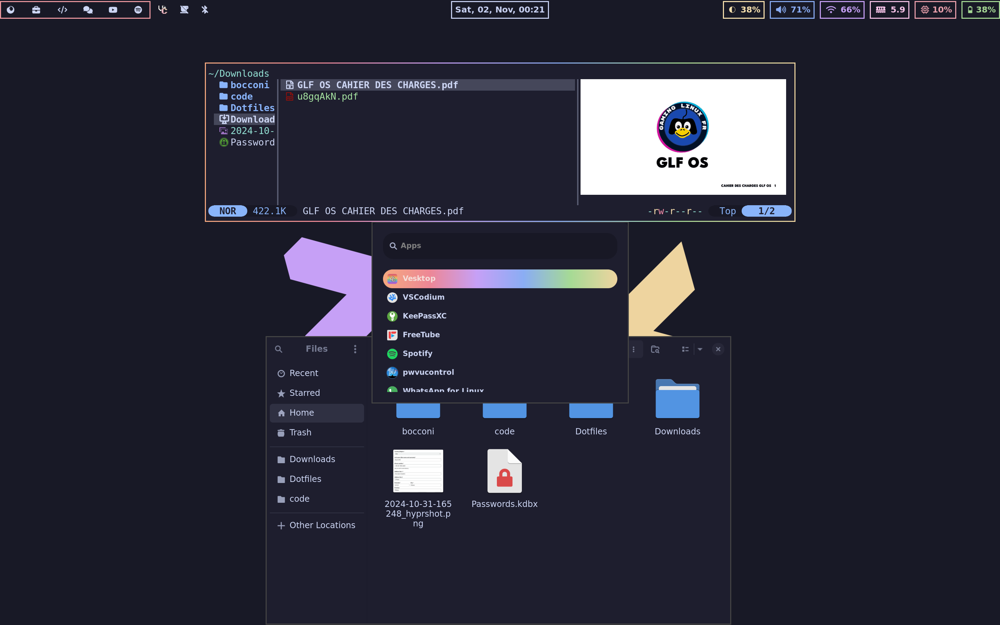

<h1 align="center">
    
   <br>
      NixOS For NEWBIES
   <br>
       <br>
      <br>
   </div>
</h1>






## What Do I Use

### System
- **Shell:** ```zsh```
- **Kernel:** CachyOS default kernel
- **Display Manager:** [Tuigreet](https://github.com/apognu/tuigreet) ![rust][rs]
- **Window Manager:** [Hyprland](https://github.com/hyprwm/Hyprland) ![C++][cpp] [Sway](https://github.com/swaywm/sway) ![C][c]

#### Hypr Ecosystem
- [Hyprlock](https://github.com/hyprwm/hyprlock) ![C++][cpp]
- [Hypridle](https://github.com/hyprwm/hypridle) ![C++][cpp]
- [Hyprshot](https://github.com/Gustash/Hyprshot) ![shell][sh]
- [Hyprpaper](https://github.com/hyprwm/hyprpaper) ![C++][cpp]
- [Hyprpicker](https://github.com/hyprwm/hyprpicker) ![C++][cpp]

#### Sway Ecosystem
- [Swaybg](https://github.com/swaywm/swaybg) ![C][c]
- [Swaylock](https://github.com/swaywm/swaylock) ![C][c]
- [Swayidle](https://github.com/swaywm/swayidle) ![C][c]

- **Status Bar:** [Waybar](https://github.com/Alexays/Waybar) ![C++][cpp]

- **Notification Daemon:** [Dunst](https://dunst-project.org/) ![C][c]

- **Application Launcher:** [Wofi](https://gitlab.com/dgirault/wofi) ![C][c]

- **Display:** [Kanshi](https://git.sr.ht/~emersion/kanshi) ![C][c] [wlr-randr](https://sr.ht/~emersion/wlr-randr/) ![C][c]

- **Recording:** [gpu-screen-recorder-gtk](https://git.dec05eba.com/gpu-screen-recorder-gtk/about/) ![C++][cpp] 

### Apps

- **Terminal:** [Foot](https://codeberg.org/dnkl/foot) ![C][c]
 
- **Browser:** [Floorp](https://github.com/Floorp-Projects/Floorp)

- **File Manager:** [Yazi](https://github.com/sxyazi/yazi) ![Rust][rs] [Nautilus](https://github.com/GNOME/nautilus) ![C][c]

- **IDE:** [Helix](https://helix-editor.com/) ![Rust][rs] [Vscodium](https://github.com/VSCodium/vscodium)

- **System Monitor:** [Btop](https://github.com/aristocratos/btop) ![C++][cpp]

## Architecture

### 🏠 Home

These are the dotfiles and configuration files for user-level configuration.

**Subfolders:**

- `programs` contains all of my configurations declared with Home Manager.
- `system` contains all of my window manager system configurations.

### 💻 Hosts

These are the host-specific configurations.

**Subfolders:**

- `modules` contains all of the system configurations divided into modules.

## Installation

- Install script coming

## To do !

- Declare Browser
- Remove unused config

<!-- Links -->

<!-- Languages -->
<!-- Rust -->
[rs]: https://img.shields.io/badge/-rust-orange
<!-- Nim -->
[nim]: https://img.shields.io/badge/-nim-%23ffe953
<!-- Shell/Bash -->
[sh]: https://img.shields.io/badge/-shell-green
<!-- Golang -->
[go]: https://img.shields.io/badge/-go-68D7E2
<!-- C++ -->
[cpp]: https://img.shields.io/badge/-c%2B%2B-red
<!-- C -->
[c]: https://img.shields.io/badge/-c-lightgrey
<!-- Zig -->
[z]: https://img.shields.io/badge/-zig-yellow
<!-- Vala -->
[va]: https://img.shields.io/badge/-vala-blueviolet
<!-- Dart -->
[da]: https://img.shields.io/badge/-dart-02D3B3
<!-- Python -->
[py]: https://img.shields.io/badge/-python-blue
<!-- TypeScript -->
[ts]: https://img.shields.io/badge/-TS-007BCD
