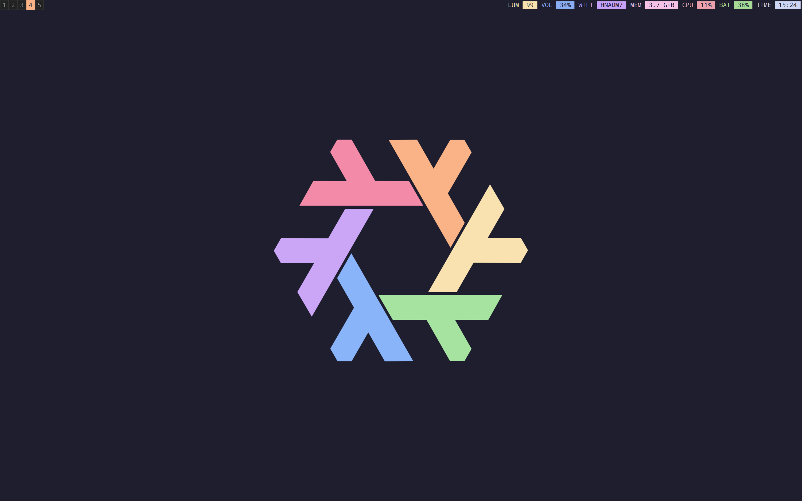
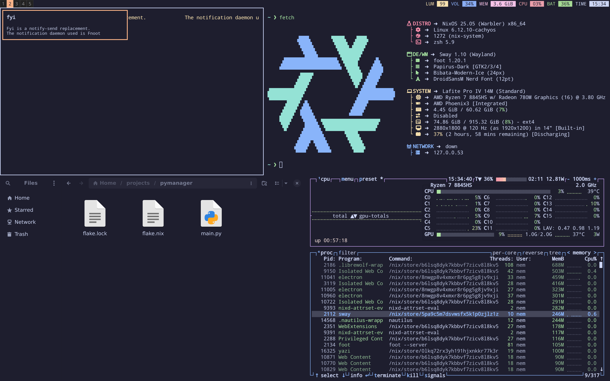
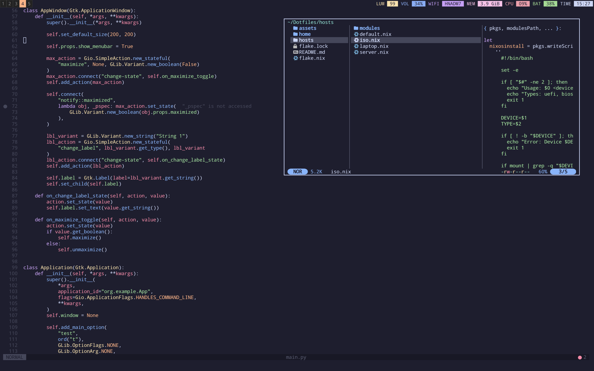

<h1 align="center">
  
   
  NixOS For NEWBIES
   
  
</h1>

## Hyprland

## Sway

# Core System
- **Shell:** `zsh`
- **Distro:** NixOS Unstable
- **Kernel:** CachyOS kernel

## Window Managers

### Hyprland Ecosystem
| Component | Description | Language |
|-----------|-------------|------------|
| [Hyprland](https://github.com/hyprwm/Hyprland) | Window Manager | ![C++][cpp] |
| [Hyprlock](https://github.com/hyprwm/hyprlock) | Screen locker | ![C++][cpp] |
| [Hypridle](https://github.com/hyprwm/hypridle) | Idle daemon | ![C++][cpp] |
| [Hyprshot](https://github.com/Gustash/Hyprshot) | Screenshot tool | ![Shell][sh] |
| [Hyprpaper](https://github.com/hyprwm/hyprpaper) | Wallpaper manager | ![C++][cpp] |
| [Hyprpicker](https://github.com/hyprwm/hyprpicker) | Color picker | ![C++][cpp] |

### Sway Ecosystem
| Component | Description | Language |
|-----------|-------------|------------
| [Sway](https://github.com/swaywm/sway) | Window Manager | ![C][c] |
| [Swaybg](https://github.com/swaywm/swaybg) | Wallpaper manager | ![C][c] |
| [Swaylock](https://github.com/swaywm/swaylock) | Screen locker | ![C][c] |
| [Swayidle](https://github.com/swaywm/swayidle) | Idle management | ![C][c] |
| [I3status](https://github.com/i3/i3status) | Status Bar for Swaybar | ![C][c] |

### System Components
| Component | Description | Language |
|-----------|-------------|-----------|
| [Tuigreet](https://github.com/apognu/tuigreet) | Login Manager | ![Rust][rs] |
| [Waybar](https://github.com/Alexays/Waybar) | Status Bar | ![C++][cpp] |
| [Dunst](https://dunst-project.org/) | Notification Daemon | ![C][c] |
| [Fnott](https://codeberg.org/dnkl/fnott) | Notification Daemon | ![C][c] |
| [Wofi](https://gitlab.com/dgirault/wofi) | Application Launcher | ![C][c] |
| [Anyrun](https://github.com/anyrun-org/anyrun) | Application Launcher | ![Rust][rs] |
| [wlr-randr](https://sr.ht/~emersion/wlr-randr/) | Display Output Manager| ![C][c] |
| [wdisplays](https://github.com/MichaelAquilina/wdisplays) | Display Output Manager | ![C][c] |
| [gpu-screen-recorder-gtk](https://git.dec05eba.com/gpu-screen-recorder-gtk/about/) | Screen Recorder | ![C++][cpp] |

### Applications
| Component | Description | Language |
|-----------|-------------|-----------|
| [Foot](https://codeberg.org/dnkl/foot) | Terminal Emulator | ![C][c] |
| [Yazi](https://github.com/sxyazi/yazi) | Terminal File Manager | ![Rust][rs] |
| [Nautilus](https://github.com/GNOME/nautilus) | File Manager | ![C][c] |
| [Helix](https://helix-editor.com/) | Text Editor | ![Rust][rs] |
| [VSCodium](https://github.com/VSCodium/vscodium) | IDE | - |
| [Btop](https://github.com/aristocratos/btop) | System Monitor | ![C++][cpp] |
| [Librewolf](https://github.com/Floorp-Projects/Floorp) | Web Browser | - |

---

# Repository Structure

### 🏠 Home Directory
Configuration files for user-level settings:
- `programs/`: Home Manager configurations
- `system/`: Window manager system configurations

### 💻 Hosts Directory
Host-specific configurations:
- `modules/`: System configurations divided into modules

---

# Installation

## Overview
Install Script upcoming ...

<!-- Badge Definitions -->
[rs]: https://img.shields.io/badge/-rust-orange
[nim]: https://img.shields.io/badge/-nim-%23ffe953
[sh]: https://img.shields.io/badge/-shell-green
[go]: https://img.shields.io/badge/-go-68D7E2
[cpp]: https://img.shields.io/badge/-c%2B%2B-red
[c]: https://img.shields.io/badge/-c-lightgrey
[z]: https://img.shields.io/badge/-zig-yellow
[va]: https://img.shields.io/badge/-vala-blueviolet
[da]: https://img.shields.io/badge/-dart-02D3B3
[py]: https://img.shields.io/badge/-python-blue
[ts]: https://img.shields.io/badge/-TS-007BCD
