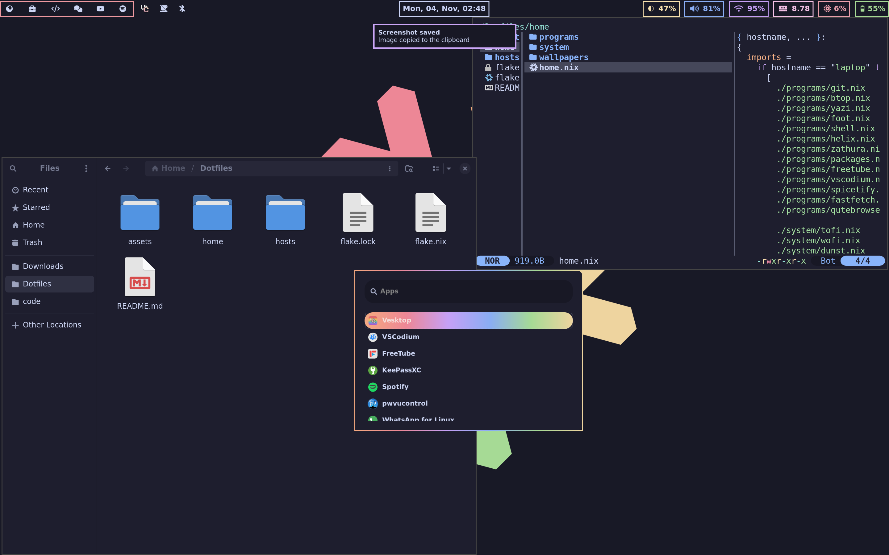

<h1 align="center">
  
   
  NixOS For NEWBIES
   
  
</h1>

# Desktop Environments

## Hyprland

## Sway

# System Configuration

## Core System
- **Shell:** `zsh`
- **Kernel:** CachyOS default kernel
- **Display Manager:** [Tuigreet](https://github.com/apognu/tuigreet) ![Rust][rs]

## Window Managers
- [Hyprland](https://github.com/hyprwm/Hyprland) ![C++][cpp]
- [Sway](https://github.com/swaywm/sway) ![C][c]

### Hyprland Ecosystem
| Component | Description | Technology |
|-----------|-------------|------------|
| [Hyprlock](https://github.com/hyprwm/hyprlock) | Screen locker | ![C++][cpp] |
| [Hypridle](https://github.com/hyprwm/hypridle) | Idle daemon | ![C++][cpp] |
| [Hyprshot](https://github.com/Gustash/Hyprshot) | Screenshot tool | ![Shell][sh] |
| [Hyprpaper](https://github.com/hyprwm/hyprpaper) | Wallpaper manager | ![C++][cpp] |
| [Hyprpicker](https://github.com/hyprwm/hyprpicker) | Color picker | ![C++][cpp] |

### Sway Ecosystem
| Component | Description | Technology |
|-----------|-------------|------------|
| [Swaybg](https://github.com/swaywm/swaybg) | Background setter | ![C][c] |
| [Swaylock](https://github.com/swaywm/swaylock) | Screen locker | ![C][c] |
| [Swayidle](https://github.com/swaywm/swayidle) | Idle management | ![C][c] |

## System Components
- **Status Bar:** [Waybar](https://github.com/Alexays/Waybar) ![C++][cpp]
- **Notification Daemon:** [Dunst](https://dunst-project.org/) ![C][c]
- **Application Launchers:** 
  - [Wofi](https://gitlab.com/dgirault/wofi) ![C][c]
  - [Anyrun](https://github.com/anyrun-org/anyrun) ![Rust][rs]
- **Display Management:**
  - [Kanshi](https://git.sr.ht/~emersion/kanshi) ![C][c]
  - [wlr-randr](https://sr.ht/~emersion/wlr-randr/) ![C][c]
- **Screen Recording:** [gpu-screen-recorder-gtk](https://git.dec05eba.com/gpu-screen-recorder-gtk/about/) ![C++][cpp]

# Applications

## Development Tools
- **Terminal:** [Foot](https://codeberg.org/dnkl/foot) ![C][c]
- **IDEs:**
  - [Helix](https://helix-editor.com/) ![Rust][rs]
  - [VSCodium](https://github.com/VSCodium/vscodium)

## Daily Use
- **Browser:** [Floorp](https://github.com/Floorp-Projects/Floorp)
- **File Managers:**
  - [Yazi](https://github.com/sxyazi/yazi) ![Rust][rs]
  - [Nautilus](https://github.com/GNOME/nautilus) ![C][c]
- **System Monitor:** [Btop](https://github.com/aristocratos/btop) ![C++][cpp]

# Repository Structure

## 🏠 Home Directory
Configuration files for user-level settings:
- `programs/`: Home Manager configurations
- `system/`: Window manager system configurations

## 💻 Hosts Directory
Host-specific configurations:
- `modules/`: System configurations divided into modules

# Setup

## Installation
- Installation script (coming soon)

## Todo List
- [ ] Declare Browser configuration
- [ ] Remove unused configurations

<!-- Badge Definitions -->
[rs]: https://img.shields.io/badge/-rust-orange
[nim]: https://img.shields.io/badge/-nim-%23ffe953
[sh]: https://img.shields.io/badge/-shell-green
[go]: https://img.shields.io/badge/-go-68D7E2
[cpp]: https://img.shields.io/badge/-c%2B%2B-red
[c]: https://img.shields.io/badge/-c-lightgrey
[z]: https://img.shields.io/badge/-zig-yellow
[va]: https://img.shields.io/badge/-vala-blueviolet
[da]: https://img.shields.io/badge/-dart-02D3B3
[py]: https://img.shields.io/badge/-python-blue
[ts]: https://img.shields.io/badge/-TS-007BCD
